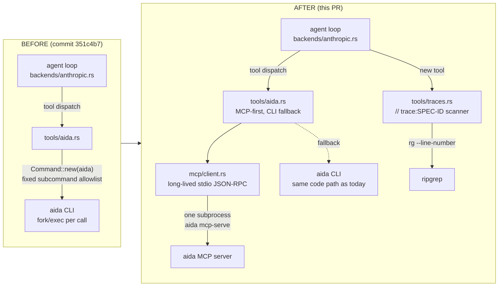

# EPIC-16 — aida-chat → first-PoC aida-consumer (PR 1: MCP-first + trace/citation)

## Context

aida-chat (commit `351c4b7`) is a 10-day-old Leptos+Axum MVP whose AIDA
access path is `Command::new("aida")` shelled out to a fixed allowlist of
subcommands (`list`/`show`/`search`/`history`). EPIC-16 reframes
aida-chat as the **first non-dogfood AIDA consumer** — the proof that
AIDA's substrate is consumable from outside, that the plug-in pattern
works, and that grounded chat creates a virtuous loop back into the
substrate.

EPIC-16 is large (MCP-first + 5 feedback loops + differentiation
surface). **This PR carves off the foundational slice**: switch aida-chat
to consume AIDA over MCP (with the existing CLI as a fallback), add a
trace-web tool so the model can map SPEC-IDs to file:line, and tighten
the system prompt so every claim is attributed. The 5 feedback loops are
named at the bottom as follow-up PRs.

Out of scope for this PR: chat → spec comment, chat → new task, chat →
memory, chat → plan seed, chat → trace-gap detection, multi-project,
hosted SaaS, calibration/lifecycle UI affordances.

## Architecture shift



Key shapes:
- The agent loop and SSE transport are untouched. The change is below
  `tools::dispatch`.
- One `aida mcp-serve` subprocess per server process (not per session,
  not per call) — singleton, lazy-spawned, restarted on failure. Modeled
  on `backends::claude_cli`'s `LiveProcessRegistry` but simpler (one
  entry instead of a map).
- The set of model-visible tools stays compatible (existing
  `aida_list`/`aida_show`/`aida_search`/`aida_history` keep their names
  and schemas) so model behavior doesn't regress; the implementations
  swap underneath. Two **new** tools are added: `aida_resource` (for
  things MCP exposes that the CLI doesn't — plan archive, punt ledger,
  comments) and `find_traces`.

## Implementation

### 1. New module: `src/server/mcp/` (stdio MCP client)

Files: `src/server/mcp/mod.rs`, `src/server/mcp/client.rs`,
`src/server/mcp/protocol.rs`.

- Minimal JSON-RPC 2.0 framing over stdio (one JSON object per line —
  what `aida mcp-serve` emits). Don't pull `rmcp` or another SDK; ~200
  LOC keeps the auditable, dependency-light ethos of the existing
  `tools/` modules.
- Public surface (used by `tools/aida.rs`):
  - `McpClient::global(cfg) -> Result<&'static McpClient, McpError>`
    (`OnceCell`, lazy spawn).
  - `client.call_tool(name, args: Value) -> Result<String, McpError>`
  - `client.list_resources() -> Result<Vec<ResourceMeta>, McpError>`
  - `client.read_resource(uri: &str) -> Result<String, McpError>`
- Internal: per-request `id` counter, `oneshot` map keyed by id, single
  reader task draining stdout into the response map, single writer
  serializing requests onto stdin behind a `Mutex<ChildStdin>`. Reuse
  the stderr-tail + start-kill patterns from
  `backends/claude_cli.rs:268-292`.
- Initialize handshake (`initialize` + `notifications/initialized`)
  performed once during `global()` construction. If `aida mcp-serve`
  isn't available or the handshake fails, `global()` returns
  `Err(McpError::Unavailable)` and the caller falls back to CLI.

### 2. Switch `src/server/tools/aida.rs` to MCP-first with CLI fallback

Keep the existing four tool *specs* (`aida_list_spec`, `aida_show_spec`,
`aida_search_spec`, `aida_history_spec`) unchanged so the agent's
contract is stable. Rewrite the four executors to:

1. Try `McpClient::global(cfg).call_tool("list_requirements"|"show_requirement"|"search_requirements"|"history", args)`.
2. On `McpError::Unavailable`, fall through to today's
   `run_aida(...)` path. Other errors (`McpError::ToolFailed`) propagate
   up as `ToolError::Execution`.
3. Argument translation lives in this file (e.g. CLI's `--status approved`
   becomes MCP's `{"status": "approved"}`). The MCP tool names above are
   the ones EPIC-16 specifies; if AIDA's MCP server uses different names,
   change them in **one** place here.

The `is_simple_token` / `is_spec_id` validators stay — they're equally
useful as MCP input guards (`aida show` injection isn't possible, but
guarding bad input early gives clearer errors than waiting for the MCP
server's reject).

### 3. New tool: `aida_resource`

Add to `src/server/tools/aida.rs`. Exposes
`McpClient::list_resources` + `read_resource` to the model so it can
reach the plan archive and punt ledger that the CLI doesn't surface.
Single tool, two modes via `action: "list" | "read"`:

```
{ "action": "list" }                  -> uri list
{ "action": "read", "uri": "..." }    -> resource contents
```

Tool description tells the model: "Use for plan archives, punt ledger,
calibration data — anything the aida_list/show tools don't cover." Skip
this tool gracefully when MCP is unavailable (return a clear "not
available without MCP" error rather than CLI fallback, since there's no
CLI equivalent).

### 4. New tool: `find_traces` (`src/server/tools/traces.rs`)

The differentiation surface. The codebase is full of `// trace:SPEC-ID`
comments (`grep -RE "// trace:[A-Z]+-[0-9]+"` finds dozens in
`src/`, `.aida/config.toml`, `.gitignore`). The model needs a fast way
to ask "where is EPIC-1 implemented?" and get back file:line answers
that ground every claim.

- Tool spec: input is a `spec_id` (e.g. `"EPIC-1"`), optional
  `path_glob`. Output: `path:line:trace-comment-text` lines, sorted.
- Implementation: ripgrep with `\btrace:(\S+\s+)*SPEC-ID\b` regex (a
  trace comment can list multiple IDs, e.g. `// trace:STORY-3 STORY-15`).
  Reuse `src/server/tools/grep.rs`'s `Command::new("rg")` pattern and
  glob-prefix guard (lines 55-76). `--glob '!.git'` and
  `--glob '!.aida-store'` carry over.
- Register in `tools/mod.rs::all_tool_specs` + `dispatch`.

### 5. System prompt update (`backends/anthropic.rs::system_prompt`)

Today's prompt at `src/server/backends/anthropic.rs:304-323` tells the
model what tools exist. Add three lines:

- "Every factual claim about this project must be attributed: cite
  `SPEC-ID` for requirements claims and `path:line` for code claims."
- "To map a SPEC-ID to where it is implemented, call `find_traces`
  before reading files — it is faster than grep_repo for that question."
- "For plan archives, punt ledger, comments, or anything you can't get
  from `aida_list`/`aida_show`, try `aida_resource` with `action:
  'list'` first to see what's exposed."

The claude-cli backend already inherits MCP via the repo's `.mcp.json`,
so no change there — but its system message (set by `claude` itself) is
not under our control. Plan only adjusts the anthropic backend's prompt;
parity with claude-cli is a separate concern.

### 6. Config + dependency

- `Cargo.toml`: no new deps (custom MCP client is hand-rolled on
  existing `tokio` + `serde_json`).
- `ServerConfig`: add `mcp_command: PathBuf` (default `"aida"`) and
  `mcp_args: Vec<String>` (default `["mcp-serve"]`). Read from env
  `AIDA_CHAT_MCP_COMMAND` / `AIDA_CHAT_MCP_ARGS` for override; matches
  the `AIDA_CHAT_*` env-var convention already used for backend/model/repo.

### 7. Files touched

| File | Change |
|---|---|
| `src/server/mcp/mod.rs` | new — re-exports `McpClient`, `McpError` |
| `src/server/mcp/client.rs` | new — long-lived stdio JSON-RPC client |
| `src/server/mcp/protocol.rs` | new — request/response types, framing |
| `src/server/tools/aida.rs` | rewrite four executors MCP-first; add `aida_resource` |
| `src/server/tools/traces.rs` | new — `find_traces` |
| `src/server/tools/mod.rs` | declare `traces`, register two new specs in `all_tool_specs` + `dispatch` |
| `src/server/mod.rs` | declare `pub mod mcp;` |
| `src/server/backends/anthropic.rs` | three-line system_prompt addition |
| `src/server/config.rs` | new `mcp_command` / `mcp_args` fields + env wiring |
| `Cargo.toml` | nothing |

`backends/claude_cli.rs`, `api.rs`, `sessions.rs`, `app.rs`,
`messages.rs` — **untouched**.

## What to reuse, not reinvent

- `backends/claude_cli.rs`'s `LiveProcessRegistry` + `spawn_actor` +
  `stderr_buf` patterns (lines 132-292). The MCP client is the same
  shape — long-lived subprocess, line-delimited JSON, drop-on-eviction —
  but with one global entry instead of a per-session map. Read it before
  writing `mcp/client.rs`.
- `tools/grep.rs`'s `Command::new("rg")` invocation (lines 55-92) for
  `find_traces` — same glob guard, same exit-code-1 handling.
- `tools/fs.rs::resolve_within_repo` if `aida_resource` ever needs to
  resolve a returned file URI within the repo (not needed for v1 since
  MCP resources are opaque strings to us).

## Verification

1. `cargo build --features ssr` — compiles with the new module.
2. `cargo test --features ssr` — existing tests still pass; add:
   - `mcp/client.rs` test: spin up an in-process mock stdio peer that
     answers `initialize` + one `tools/call`, assert the client
     round-trips correctly and handles a malformed response without
     deadlocking.
   - `tools/aida.rs` test: with MCP forced unavailable, `aida_list`
     falls back to CLI (mocked via `which`-style guard or
     `AIDA_CHAT_MCP_COMMAND=/bin/false`).
   - `tools/traces.rs` test: write a temp file with three trace
     comments, assert `find_traces("EPIC-1")` returns exactly the
     matching lines.
3. **Manual** (this is the proof point — no test substitutes for it):
   - `export ANTHROPIC_API_KEY=...; cargo leptos serve`.
   - Open `http://127.0.0.1:8091`.
   - Prompt 1: *"List the approved EPICs in this project."* Expect
     `aida_list` to fire and the response to cite SPEC-IDs.
   - Prompt 2: *"Where is EPIC-1 implemented? Show me the file and
     line."* Expect `find_traces` to fire and the response to cite
     `src/server/mod.rs:1` (the `// trace:EPIC-1` comment).
   - Prompt 3: *"What plan archives or punt-ledger entries does the
     substrate expose?"* Expect `aida_resource` with `action: "list"`
     to fire (or a clean "MCP unavailable" if `aida mcp-serve` isn't on
     PATH).
   - Force MCP off (`AIDA_CHAT_MCP_COMMAND=/bin/false`), reload, repeat
     prompt 1: expect the CLI fallback path to handle it transparently.

## Follow-up PRs (named, not implemented here)

- **EPIC-16/PR-2**: chat → spec comment (loop 1). New `propose_comment`
  tool emits a structured suggestion; UI renders an "Apply to SPEC-XX"
  button; confirmation triggers `aida comment add` via CLI.
- **EPIC-16/PR-3**: chat → new task/bug (loop 2). Same pattern with
  `aida add`.
- **EPIC-16/PR-4**: chat → memory (loop 3). Write to
  `~/.claude/projects/<slug>/memory/`.
- **EPIC-16/PR-5**: chat → plan seed (loop 4). `aida ultraplan` handoff.
- **EPIC-16/PR-6**: chat → trace-gap detection (loop 5). Background scan
  job using `find_traces` + LLM judge.

Each loop is one focused PR that builds on the foundation this PR
establishes.
